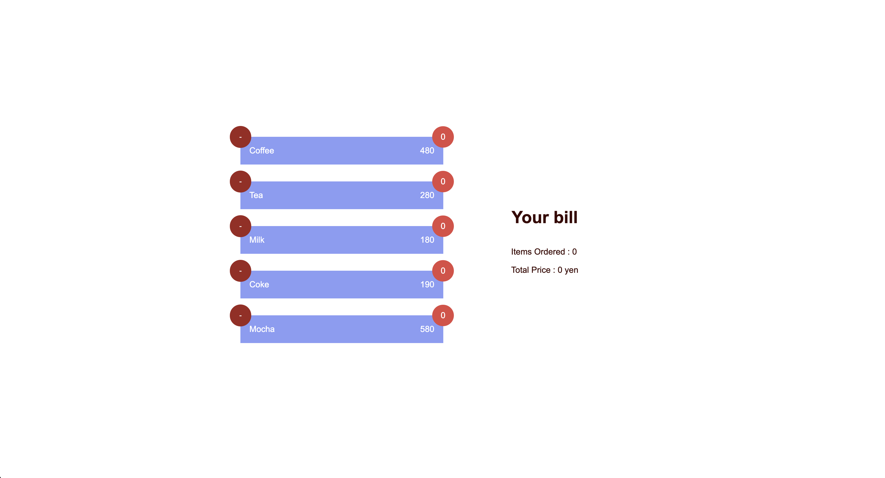
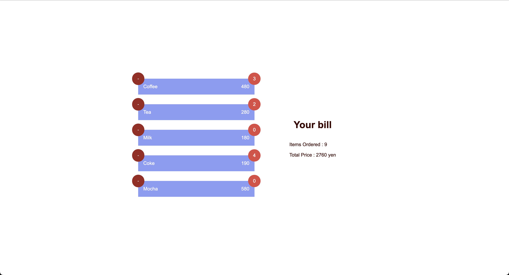

**Disclaimer**

According to the task description, I figured out that there is no `remove` functionality. There could be a usecase where customer order an item but the order taker entered different or customer might change their mind and would like to modofy there order etc. For that reason, I also added a `remove` button at the top left corner of each item.

Moreover, I implemented the whole project once and used only one commit in `develop` branch. Since it is a pretty small project I decided to use this approach rather than creating feature branches to each feather and `rebase` them with main branches.

# Contributors

1. @YasudaGento
2. @ArtemBezu
3. @naikkartik-mf
4. @hidemi-akiyam
5. @ookura-mf
6. @zafar-saleem

# Folder structure

Below is the entire folder structure.

```
├── README.md
├── index.html
├── package.json
├── public
│   └── vite.svg
├── src
│   ├── App.css
│   ├── App.tsx
│   ├── assets
│   │   └── react.svg
│   ├── components
│   │   ├── bill
│   │   │   ├── bill.styled.tsx
│   │   │   ├── bill.tsx
│   │   │   └── index.tsx
│   │   ├── counter
│   │   │   ├── counter.styled.tsx
│   │   │   ├── counter.tsx
│   │   │   ├── index.tsx
│   │   │   └── interfaces.tsx
│   │   ├── index.tsx
│   │   ├── item
│   │   │   ├── index.tsx
│   │   │   ├── interfaces.tsx
│   │   │   ├── item.styled.tsx
│   │   │   └── item.tsx
│   │   ├── remove
│   │   │   ├── index.tsx
│   │   │   ├── interfaces.tsx
│   │   │   ├── remove.styled.tsx
│   │   │   └── remove.tsx
│   │   └── utils
│   │       ├── container
│   │       │   ├── container.styled.tsx
│   │       │   ├── container.tsx
│   │       │   ├── index.tsx
│   │       │   └── interfaces.tsx
│   │       ├── grid
│   │       │   ├── grid.styled.tsx
│   │       │   ├── grid.tsx
│   │       │   ├── index.tsx
│   │       │   └── interfaces.tsx
│   │       └── index.tsx
│   ├── index.css
│   ├── interfaces
│   │   └── interfaces.tsx
│   ├── main.tsx
│   ├── pages
│   │   └── products
│   │       ├── fakeData.ts
│   │       ├── hooks
│   │       │   ├── index.tsx
│   │       │   └── useTrakafe.tsx
│   │       ├── index.tsx
│   │       ├── interfaces.tsx
│   │       ├── products.styled.tsx
│   │       └── products.tsx
│   ├── theme
│   │   ├── globals.ts
│   │   ├── index.ts
│   │   ├── screens
│   │   │   ├── breakpoints.ts
│   │   │   └── index.ts
│   │   ├── theme.ts
│   │   ├── tokens
│   │   │   ├── colors.ts
│   │   │   ├── gutter.ts
│   │   │   ├── index.ts
│   │   │   ├── palette.ts
│   │   │   └── sizes.ts
│   │   └── typography
│   │       ├── index.ts
│   │       └── typography.ts
│   └── vite-env.d.ts
├── tsconfig.json
├── tsconfig.node.json
├── vite.config.ts
└── yarn.lock
```

## Introduction

Trakafe is an order system for cafeterias where customer make order for their favorite drinks and beverages. This is a sample assignment for `Money Forward` for my job application.

In this project I decided to use `vite` instead of `CRA` which was mentioned in task desciption. I avoided `CRA` due to its less reliability as it is no longer maintained by it core team. While creating an app using `CRA` also throws countless warnings due to outdated dependencies.

Second reason for using `vite` is that provides better developer experience due to its ligthening fast performance.

After getting hold of the task description I figured out that it is relatively a small application therefore, I avoided to utilise routing system such as `react-router-dom`. Therefore, I created one core page i.e. `src/pages/products.tsx` and use it in `App.tsx` file to initiate the application.

I decided to use TypeScript to make this project typesafe which allows to avoid common errors.

1. components
2. pages
3. theme

### components

`components/` folder consist of `bill`, `counter`, `item`, `remove` & `utils` components. `utils` components are utility components and in this small example they are main `container` and `grid` which I decided them to be simple rather than making them over-complicated. It could easily be evolved if such projects grow in size and new use-cases are introduced etc.

### pages

I decided to use `hooks` pattern instead of going for using state base application such as `context api`, `redux`, or `mobx`. As it is a relatively simple task and such concepts would have made this task over-complicated and over-engineered which is generally considered a bad practice in our programming community.

The `src/pages/products/hooks/useTrakafe.tsx` hook uses all the logical and data part. It is responsible for retreiving data, updating and deleting.

The `src/pages/products/products.tsx` page is used to render all the components that I implemented in `src/components` folder.

### theme

I used a design system using `styled-components` which can be found in `src/theme` folder. This approach is better for having a consistent design throughtout the application and for organisation branding. You can find all the global variables inside `theme` and their respective folders.

## How to run

To install dependencies use below commands.

```bash
cd trakafe
yarn
```

To run locally.

```bash
yarn dev
```

To build

```bash
yarn build
```

To run lint

```bash
yarn lint
```
## Here is how it looks like.





